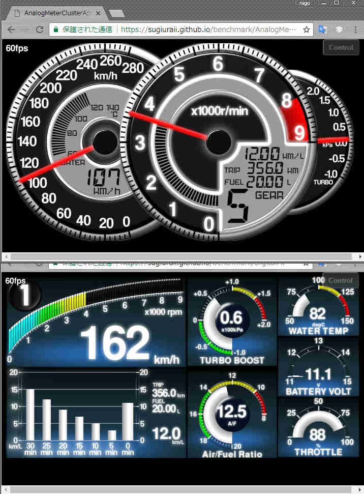
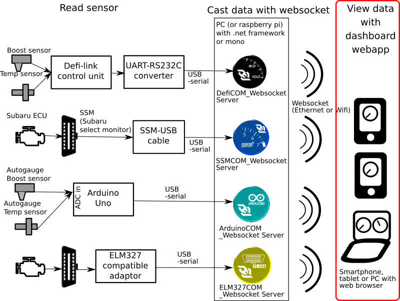

# Websocket dashboard client (new version with WebGL)



## Table of contents
* [Description](#description)
* [System diagram](#system_diagram)
* [Requirement](#requirement)
* [Dependency](#dependency)
* [Install](#install)
* [Build](#build)
* [Making custom meter panel](#custom)
* [Other documents](#otherDocs)
* [License](#license)

## <a name="description">Description</a>
This program is graphical dashboard gauge, web-based client for [DefiSSMCOM_WebsocketServer](https://github.com/sugiuraii/DefiSSMCOM_WebsocketServer).

This program receive car sensor information from the websocket server programs, and show sensor data by WebGL(or Canvas) based graphical gauges.

The graphical part of this program depends on [PIXI.js](http://www.pixijs.com/). Thanks to PIXI.js, this program can show the gauge in HTML5 Canvas if the browser does not support WebGL (However performance (fps) is degraded compared to WebGL).

You can make your custom gauges by modifying the source code. Please see []().

## <a name="system_diagram">System diagram</a>

## <a name="requirement">Requirement</a>
* Web server PC or appliance to distribute html and javascript files to browsers.
* Web browser to view dashboard gauges.
	* Web browser capable of WebGL or Canvas
		* To get sufficient performance (over 30fps), currently Chrome + WebGL is recommended.
		* You can check the operation (and grahical performance) by following demonstration pages.
			* [Test1 (Analog 3-meter cluster test)](https://sugiuraii.github.io/WebsocketGauge/clientdemo/benchmark/AnalogMeterClusterBenchApp.html)
			* [Test2 (Digital multi function display test)](https://sugiuraii.github.io/WebsocketGauge/clientdemo/benchmark/DigitalMFDBenchApp.html)
	* Operation is tested following platforms.

		| Browser |	 OS	 | Hardware | fps(Test1) | fps(Test2) | comment |
		|--------|--------|--------|--------|--------|--------|
		| Google Chrome 59.0 | Windows 10 | Toshiba Satellite C640<br> Core i5-560M | 60fps | 60fps | OK |
        | Firefox 54.0.1 | Windows 10| Toshiba Satellite C640<br> Core i5-560M | 27fps | 27fps | Slow |
        | Microsoft Edge | Windows 10| Toshiba Satellite C640<br> Core i5-560M | - | - | Some of sprites are missing.|
        | Google Chrome 59.0 | Android 6.0.1 | ASUS Zenfone2 <br> (ZE551ML Atom Z3560) | 60fps | 60fps | OK |
        | Google Chrome 59.0 | Android 4.1.2| Sharp 203SH <br> (Snapdragon S4 Pro) | 54-60fps | 50-60fps | OK |
        | Google Chrome 61.0 | Android 7.0 | Oukitel C8 <br> (Mediatek MTK6580) | 54fps | 47fps | ARM Mali-400 series　seems to have blinking issue in pixi.js under WebGL. `forceCanvas` or `preserveDrawingBuffer` needs to be enabled. |
        | Safari | iOS 9.3.5 | iPhone 4s <br> (Apple A5) | [54-60fps](https://www.youtube.com/watch?v=ZE71ya6LY0U) | [47fps](https://www.youtube.com/watch?v=ZE71ya6LY0U) | OK |

## <a name="dependency">Dependency</a>
* [Node.js (Version.8.2.1)](https://nodejs.org/)
* [jQuery](https://jquery.com/)
* [PIXI.js](http://www.pixijs.com/)
* [webpack](https://webpack.github.io/)
* [TypeScript](https://www.typescriptlang.org/)

## <a name="build">Build</a>
This program coded by typescript. And this program uses webpack for deployment.
Before modifying the source code (including makinig your custom meter panel or parts), node.js and dependent packages need to be installed.

### Install node.js
Install node.js. On windows, you can find the installer on [official node.js site](https://nodejs.org/).
To build sources, node.js newer than 8.x is needed (since build script calls `npx` comand).

### Install dependent npm packages
Before build, please install dependent npm packages. Dependent npm packages can be installed automatically by simply running `npm install`,
```
> cd WebSocketGaugeClientNeo
> npm install
```
### Buidling source
Build command is incuded in npm scirpt (please see `package.json`). To build,
```
> cd WebSocketGaugeClientNeo
> npm run build-WebSocketTester
> npm run build-benchmark
> npm run build-application
```

## <a name="custom">Making custom meter panel</a>
There are some sample source codes of meter application in [`WebSocketGaugeClientNeo/src/application`](./src/application)directoy.
To make your custom meter application, refer [CustomMeterApp.md](./docs/CustomMeterApp.md)

## <a name="install">Install</a>
After buiding sources, compiled htmls and javascripts will be stored in `public_html` folder. Please copy these files to your web server (e.g. nginx) export directory.

## <a name="otherDocs">Other docuents</a>
* [docs/CustomMeterApp.md](docs/CustomMeterApp.md)
	* Making own meter application class(setting up websocket communication and place of meter parts).
* [docs/MeterAppBuild.md](docs/MeterAppBuild.md)
	* Set up the build parameter (typescript and webpack).
* [docs/CustomMeterParts.md](docs/CustomMeterParts.md)
* [docs/MeterPrimitive.md](docs/MeterPrimitive.md)
	* Making own meter parts classes (with you original meter design).

## <a name="license">License</a>
[MIT License](./LICENSE)
