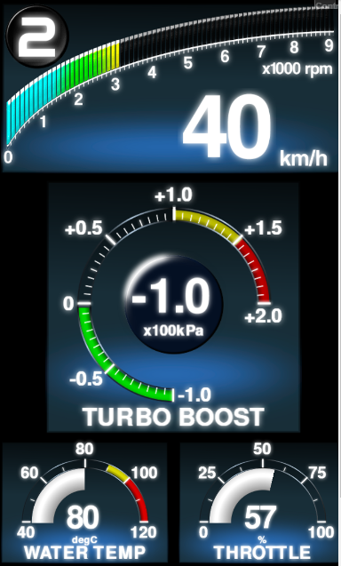
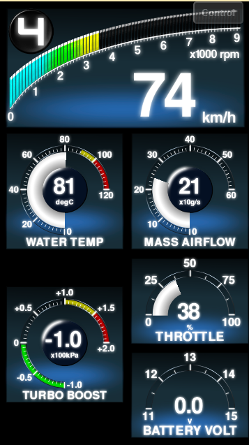

# Making custom meter gauge application.

## Table of contents
* Directroy map of sources
* Register application html and typescript files to webpack.

## Meter application source files.

Meter application (top level deifition of meter panel that consist of meter parts and websocket communication) is stored in `WebSocketGaugeClientNeo/application` directory.

One meter application consists of one html file and one typescript file.
* Html file (For example, `DigitalMFD-ELM327DemoApp.html`).
* Application source code file (For example, `DigitalMFD-ELM327DemoApp.ts`)

The *.html file simply calls javascript file. The main part of application logic is described in typescript file.
(The typescript file finally will be compiled to javascript file by typescirpt oompiler.)

In this document, `DigitalMFD-ELM327DemoApp.ts` and `DigitalMFD-ELM327DemoApp.html` will be used to explain the application coding.

## Bundle html file with typescript file.
`DigitalMFD-ELM327DemApp.ts`
```js
// Set entry point html file to bundle by webpack
require("./DigitalMFD-ELM327DemoApp.html");
```
The html file is need to be bundled with the application typescirpt file as the `require()` statement above.
By using sthis information, webpack will bundle html file and type script file, and build to `WebSocketGaugeClientNeo/public_html` directory.

## Import dependent modules
`DigitalMFD-ELM327DemoApp.ts`
```js
//Import application base class
import {MeterApplicationBase} from "../lib/MeterAppBase/MeterApplicationBase";

//Import meter parts
import {WaterTempGaugePanel} from "../parts/CircularGauges/SemiCircularGaugePanel";
import {ThrottleGaugePanel} from "../parts/CircularGauges/SemiCircularGaugePanel";
import {DigiTachoPanel} from "../parts/DigiTachoPanel/DigiTachoPanel";
import {BoostGaugePanel} from "../parts/CircularGauges/FullCircularGaugePanel";

//Import enumuator of parameter code
import {OBDIIParameterCode} from "../lib/WebSocket/WebSocketCommunication";
import {ReadModeCode} from "../lib/WebSocket/WebSocketCommunication";
```
Import several modules by `import{}` statement. In meter application source, following modules should be imported.
* `MeterApplicationBase` class
	* Base class of meter application, that contains common parts (websocket status indicator, log window and some controls), common logics, and websocket communication objects.
		* Websocket communication object is imclued in `MeterapplicationBase`class. Do not need to import separately.
* Meter parts classes
	* Defines parts of meter panel. In `DigitalMFD-ELM327DemoApp.ts`, four types of meter parts are imported.
	* The source code of mater panel parts exists in `WebSocketGaugeClientNeo/parts` directory. You can add your original design meter parts.
	
* Parameter code enumator modlules
 	* Define enumator of parameter code (Engine_Speed, Manifold_Absolute_Pressure, etc...).
 	* Import the parameter code module corresponding the websocket server to communicate.
 		* ELM327(OBDII) : `OBDIIParameterCode`
 		* Arduino ADC : `ArduinoParameterCode`
 		* Defi Link : `DefiParameterCode`
 		* Subaru SSM : `SSMParameterCode` and `SSMSwitchCode`
 			* For ELM327 and SSM, `ReadModeCode` also should be imported. (This defines read mode (interval of sending data from ECU)).

## Application entry point

`DigitalMFD-ELM327DemoApp.ts`
```js
window.onload = function()
{
    const meterapp = new DigitalMFD_ELM327DemoApp(720, 1280);
    meterapp.run();
}
```
This entry point method (`window.onload()`) is called when the browser finish loading html files.
(But it should be noted that browser do not wait to finish loading picture and font files. Because of that, preload setting should be defined in application class).
Construct application class (described below), and start application class with `run()` method.

## Definition of application class
`DigitalMFD-ELM327DemoApp.ts`
```js
class DigitalMFD_ELM327DemoApp extends MeterApplicationBase
{
    protected setWebSocketOptions()
    {
    ...
    }
    protected setTextureFontPreloadOptions()
    {
    ...
    }
    protected setPIXIMeterPanel()
    {
    ...
    }
```

The application class of `DigitalMFD_ELM327DemoApp` extends the base (abstract) class of MeterApplicationBase. The `MeterApplicationBase` class requires its subclass to implement follwoing method.
* `setWebSocketOptions()`
	* Method to setup websocket communication.
	* Enabling websocket communication, register parameter code (Engine_Speed, Manifold_Absolute_Pressure, etc...) to communicate).
* `setTextureFontPreloadOptions()`
	* Method to setup preloading picture (textures, sprites) and font files.
* `setPIXIMeterPanel()`
	* Setup the actual design and operation of meter panel.
	* Construct meter parts, set the position of meter parts, and define the operation on every animation frame.

### Setup websocket communication (by implementing `setWebSocketOptions()`)
`DigitalMFD-ELM327DemoApp.ts`
```js
protected setWebSocketOptions()
{
    //Enable ELM327 websocket client
    this.IsELM327WSEnabled = true;

    this.registerELM327ParameterCode(OBDIIParameterCode.Engine_Speed, ReadModeCode.SLOWandFAST, true);
    this.registerELM327ParameterCode(OBDIIParameterCode.Vehicle_Speed, ReadModeCode.SLOWandFAST, true);
    this.registerELM327ParameterCode(OBDIIParameterCode.Throttle_Opening_Angle, ReadModeCode.SLOWandFAST, true);
    this.registerELM327ParameterCode(OBDIIParameterCode.Coolant_Temperature, ReadModeCode.SLOW, true);
    this.registerELM327ParameterCode(OBDIIParameterCode.Manifold_Absolute_Pressure, ReadModeCode.SLOWandFAST, true);
}
```
The first part of above code sets the websocket enable flag. By setting `IsELM327WSEnabled` flag to `true`, ELM327 websocket client is enabled (this also enables websocket indicator on ELM327). Same kind of flags are also available on other websocket clents, such as..
* ELM327(OBDII) : `IsELM327WSEnabled`
* Arduino ADC : `IsArudinoWSEnabled`
* Defi Link : `IsDefiWSEnabled`
* Subaru SSM : `IsSSMWSEnabled`

The second part of above code registers the parameter code to communicate,  by the method of `registerELM327ParameterCode(code : string, readMode : string, interpolate : boolean)`.
* 1st argument of `code : string` defines the parameter code (Engine_Speed, Vehicle_Speed, etc..) to register. The candidate of parameter code can be accessed through the imported namespace of `OBDIIPamraterCode`.
* 2nd argument of `readMode : string` set the read mode of ECU communication.
	* The candidate is `SLOWandFAST`, `SLOW` and `FAST`. This can set the update cycle of each parameter (sensor reading data).
	* The update rate of `SLOW` is 10times slower than `SLOTandFAST` and `FAST` (`SLOWandFAST` and `FAST` have currenlt almost same update rate), however it can save ECU <-> websocket server bandwidth.
		* It should be noted that the bandwidth between ECU and websocket server is quite limited (especially, in the case of SSM, the baudrate between ECU and websocket server is only 4800bps.)
    * This `readMode` argument is not available on `registerDefiParameterCode()` and `registerArduinoParameterCode()`.
* 3rd argument of `interpolate : boolean` is the flag to enable or disable 'interpolation'. By setting this flag true (and using `getVal()` (instead of `getRawVal()`) in `setPIXIMeterPanel()` implementation), the meter can make smooth animation, even though update rate is low.

Of course, code registration method is also available on Arduino, Defi and SSM.
* ELM327(OBDII) : `registerELM327ParameterCode(code : string, readMode : string, interpolate : boolean)`
* Arduino ADC : `registerArduinoParameterCode(code : string, interpolate : boolean)`
* Defi Link : `registerDefiParameterCode(code : string, interpolate : boolean)`
* Subaru SSM : `registerSSMParameterCode(code : string, readMode : string, interpolate : boolean)`

### Setup picture and font preload (by implementing `setTextureFontPreloadOptions()`)
`DigitalMFD-ELM327DemoApp.ts`
```js
protected setTextureFontPreloadOptions()
{
    this.registerWebFontFamilyNameToPreload(WaterTempGaugePanel.RequestedFontFamily);
    this.registerWebFontFamilyNameToPreload(DigiTachoPanel.RequestedFontFamily);
    this.registerWebFontFamilyNameToPreload(BoostGaugePanel.RequestedFontFamily);
    this.registerWebFontFamilyNameToPreload(ThrottleGaugePanel.RequestedFontFamily);

    this.registerWebFontCSSURLToPreload(WaterTempGaugePanel.RequestedFontCSSURL);
    this.registerWebFontCSSURLToPreload(DigiTachoPanel.RequestedFontCSSURL);
    this.registerWebFontCSSURLToPreload(BoostGaugePanel.RequestedFontCSSURL);
    this.registerWebFontCSSURLToPreload(ThrottleGaugePanel.RequestedFontCSSURL);

    this.registerTexturePathToPreload(WaterTempGaugePanel.RequestedTexturePath);
    this.registerTexturePathToPreload(DigiTachoPanel.RequestedTexturePath);
    this.registerTexturePathToPreload(BoostGaugePanel.RequestedTexturePath);
    this.registerTexturePathToPreload(ThrottleGaugePanel.RequestedTexturePath);
}
```
In `setTextureFontPreloadOptions()` method, `WebFontFamilyName`, `WebFontCSSURL` and `TexturePath` shold be registered for each parts. These parameters are implemented as static properties of meter parts classes.

### Setup meter panel configuration (by implementing `setPIXIMeterPanel()`)
`DigitalMFD-ELM327DemoApp.ts`
```js
protected setPIXIMeterPanel()
{
    // Construct meter panel parts.
    const digiTachoPanel = new DigiTachoPanel();
    digiTachoPanel.position.set(0,0);
    digiTachoPanel.scale.set(1.15);

    const boostPanel = new BoostGaugePanel();
    boostPanel.position.set(90,360);
    boostPanel.scale.set(1.3);

    const waterTempPanel = new WaterTempGaugePanel();
    waterTempPanel.position.set(0,890);
    waterTempPanel.scale.set(0.85);

    const throttlePanel = new ThrottleGaugePanel();
    throttlePanel.position.set(360,890);
    throttlePanel.scale.set(0.85);

    // Add meter panel parts to stage.
    this.stage.addChild(digiTachoPanel);
    this.stage.addChild(boostPanel);
    this.stage.addChild(waterTempPanel);
    this.stage.addChild(throttlePanel);

    // Define ticker method to update meter view (this ticker method will be called every frame).
    this.ticker.add(() =>
    {
        // Take timestamp of animation frame. (This time stamp is needed to interpolate meter sensor reading).
        const timestamp = PIXI.ticker.shared.lastTime;
        // Get sensor information from websocket communication objects.
        const tacho = this.ELM327WS.getVal(OBDIIParameterCode.Engine_Speed, timestamp);
        const speed = this.ELM327WS.getVal(OBDIIParameterCode.Vehicle_Speed, timestamp);
        const neutralSw = false;
        const gearPos = this.calculateGearPosition(tacho, speed, neutralSw);

        const boost = this.ELM327WS.getVal(OBDIIParameterCode.Manifold_Absolute_Pressure, timestamp)  * 0.0101972 - 1; //convert kPa to kgf/cm2 and relative pressure

        const waterTemp = this.ELM327WS.getRawVal(OBDIIParameterCode.Coolant_Temperature);
        const throttle = this.ELM327WS.getVal(OBDIIParameterCode.Throttle_Opening_Angle, timestamp);

        // Update meter panel value by sensor data.
        digiTachoPanel.Speed = speed;
        digiTachoPanel.Tacho = tacho;
        digiTachoPanel.GearPos = gearPos;
        waterTempPanel.Value = waterTemp;
        throttlePanel.Value = throttle;
        boostPanel.Value = boost;
   });
}
```
The first half of above code create meter parts instances. Created instances are added to stage (after setting scale and position). Since meter parts class extends PIXI.Container, parts instances can be treated like pixi.js Container instances.

The latter half of above code (after the row of `this.ticker.add()`) defines the ticker. This part of code will be called  every drawing frame of application (like `requestAnimationFrame()`).


## Register application html and typescirpt files to webpack.
### Copy from existing demo application sources.
To make custom meter application, one html and one typescipt(*.ts) file is reqired.
It is recommened to use demo application file for the template.

First, copy `DigitalMFD-ELM327DemoApp.html` and `DigitalMFD-ELM327DemoApp.ts` to your prefer filename. (In this document, destination file name set to `CustomMeterpanelApp.html`and `CustomMeterpanelApp.ts`).
```
> cd WebSocketGaugeClientNeo/src/application
> cp DigitalMFD-ELM327DemoApp.html CustomMeterpanelApp.html
> cp DigitalMFD-ELM327DemoApp.ts CustomMeterpanelApp.ts
```

### Edit webpack.config.js to register webpack build target.
After that, open `WebSocketGaugeClientNeo/src/application/webpack.config.js`, and modify `module.exports={}` definition as ...

```js
module.exports = {
    entry:
    {
        "CustomMeterpanelApp" : './CustomMeterpanelApp.ts', // Add this line.
        "AnalogMeterClusterApp" : './AnalogMeterClusterApp.ts',
        "DigitalMFDApp" : './DigitalMFDApp.ts',
        "DigitalMFD-ELM327DemoApp" : './DigitalMFD-ELM327DemoApp.ts',
        "DigitalMFD-ArduinoDemoApp" : './DigitalMFD-ArduinoDemoApp.ts',
        "DigitalMFD-SSMDemoApp" : './DigitalMFD-SSMDemoApp.ts'
    },
...
```
By this, webpack will complie `CustomMeterpanelApp.ts` and its dependent source files automatically (typescript compiler of tsc will be called inside webpack), and bundle into `CustomMeterpanelApp.js`.

### Edit CustomMeterpanelApp.html
`CustomMeterpanelApp.html`(you copied on previous section) is a entry point html file. This html file should load `CustomMeterpanelApp.js` (this file should be built by webpack).

Edit `<script>` tag of `CustomMeterpanelApp.html` as follows.
```html
<html>
    <head>
    	<!-- change html titie as you like-->
        <title>CustomMeterpanelApp</title>
        <meta charset="UTF-8">

    </head>
    <body style="background: black">
    	<!-- modify here to read CustomMeterpanelApp.js -->
        <script type="text/javascript" src="js/CustomMeterpanelApp.js"></script>
    </body>
</html>
```

### Edit CustomMeterpanelApp.ts
To bundle `CustomMeterpanelApp.html` with application typescript file (`CustomMeterpanelApp.ts`), open `CustomMeterpanelApp.ts`, and edit `require()` field as below..

```js
...
//For including entry point html file in webpack
require("./CustomMeterpanelApp.html");
...
```

## Try building custom meter panel application

To build, run npm script at `WebSocketGaugeClientNeo/` directory, like,
```
(move to the directory of WebSocketGaugeClientNeo and type)..
> npm run build-application
```

After the build is finished, you may find `CustomMeterpanelApp.html` and `CustomMeterpanelApp.js` in `public_html/application` directory.

## Modify the contents of custom meter panel application
On this section, `CustomMeterpanelApp.ts` will be modified as the pictures below (left : before modification, right : after modification).
* Shrink the size of "TURBO BOOST" gauge.
* Change meter type of "WATER TEMP" (180deg gauge to 270deg gauge).
* Add "MASS AIR FLOW" and "BATTERY VOLT" gauges.


----

Definition of meter application is done in follwoing steps in `CustomMeterpanelApp.ts`.
* Import meter parts/paramter code class from library.
* Define meter application class (with extending the class of MeterApplicationBase)
	* Setup websocket communication. (by implementing `setWebSocketOptions()`)
    * Setup texture and font pre-load. (by implementing `setTextureFontPreloadOptions()`).
    * Setup meter panel contents (parts location is viewport) and parts operation (by implementing `setPIXIMeterPanel()`)

### Import meter parts/paramter code classes from library.
In meter application, each meter parts (water temp gauge, boost gauge, etc..) is described by typescript class (see below). 
These parts class are written in separate type script files and need to be imported in `CustomMeterpanelApp.ts` by `import` statement.


```js
//// Import meter parts
import {DigiTachoPanel} from "../parts/DigiTachoPanel/DigiTachoPanel";
import {BoostGaugePanel} from "../parts/CircularGauges/FullCircularGaugePanel";
import {ThrottleGaugePanel} from "../parts/CircularGauges/SemiCircularGaugePanel";
//// Changed from original DigitalMFD-ELM327DemoApp.ts
//import {WaterTempGaugePanel} from "../parts/CircularGauges/SemiCircularGaugePanel";
import {WaterTempGaugePanel} from "../parts/CircularGauges/FullCircularGaugePanel";
// Add to original DigitalMFD-ELM327DemoApp.ts
import {MassAirFlowGaugePanel} from "../parts/CircularGauges/FullCircularGaugePanel";
import {BatteryVoltageGaugePanel} from "../parts/CircularGauges/SemiCircularGaugePanel";

```