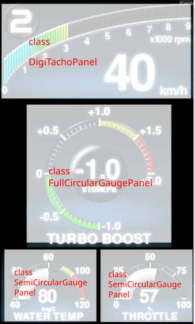

# Making custom meter application.

## Introduction


Meter application (html5 front panel view of gauge) have mainly two kind of object, one is websocket communication(client) class, and the other is meter (graphical) parts class.

Websocket client classes manage the communication with [Websocket server programs](https://github.com/sugiuraii/WebSocketGaugeServer), with parsing JSON data from Websocket server. The parsed data are sent to meter parts classes by every animation frame. The meter parts classes changes its view (rotating needle, changing progressbar, changing digital indictaor, etc..) corresponding the data received from websocket communication(client) classes.

* From version 3, new `WebsocketServiceMapper` class is available. This can map the sensor parameter code (Engine speed, MAF pres, etc..) to ECU protocols by pre-defined setting. By using this, meter application do not need to care the which kind of ECU protocol is used.  (Thus, `WebsocketServiceMapper` can act as an abstruction layer for the meter application class.)

This document will explain how to costruct meter application class. During making the application class, you can setup,
* Which kind of websocket client (Defi/SSM/Arduino/ELM327) will be used.
* Which kind of data (engine rpm, boost pressure, etc..) will be sent from websocket server.
* Which kind of meter parts will be used.
* Position and size of meter parts.

If you want to make your own meter parts (with your new design), please refer [CustomMeterParts.md](./CustomMeterParts.md) and [MeterPrimitive.md](./MeterPrimitive.md).

## Meter application source files.

Meter application (top level deifition of meter panel that consist of meter parts and websocket communication) is stored in `WebSocketGaugeClientNeo/application` directory.

One meter application consists of one html file and one typescript file.
* Html file (For example, `CompactMFD.html`).
* Application source code file (For example, `CompactMFD.ts`)

The *.html file simply calls javascript file. The main part of application logic is described in typescript file.
(The typescript file finally will be compiled to javascript file by typescirpt oompiler.)

In this document, `CompactMFD.ts` and `CompactMFD.html` will be used to explain the application coding.

## Bundle html file with typescript file.
`CompactMFD.ts`
```js
// Set entry point html file to bundle by webpack
require("./CompactMFD.html");
```
The html file is need to be bundled with the application typescirpt file as the `require()` statement above.
By using sthis information, webpack will bundle html file and type script file, and build to `WebSocketGaugeClientNeo/public_html` directory.

## Import dependent modules
`CompactMFD.ts`
```js
import * as PIXI from 'pixi.js';

//Import application base class
import { MeterApplication } from "lib/MeterAppBase/MeterApplication";
import { MeterApplicationOption } from "lib/MeterAppBase/options/MeterApplicationOption";

//Import meter parts
import { DigiTachoPanel } from "parts/DigiTachoPanel/DigiTachoPanel";
import { SemiCircularGaugePanelPresets } from "parts/CircularGauges/SemiCircularGaugePanelPresets";
import { FullCircularGaugePanelPresets } from "parts/CircularGauges/FullCircularGaugePanelPresets";

// Import AppSettings.
import * as DefaultAppSettings from  "application/DefaultAppSettings"
```
Import several modules by `import{}` statement. In meter application source, following modules should be imported.
* `pixi.js`
    * To use pixi.js for rendering.
* `DefaultAppSettings`
    * Required to handle application settings.
* `MeterApplication` and `MeterApplicationOption`class
	* Common class of meter application, that contains common parts (websocket status indicator, log window and some controls), common logics, and websocket communication objects/serivices and `WebsocketServiceMapper`.
* Meter parts classes
	* Defines parts of meter panel. In `CompactMFD.ts`, three types of meter parts are imported.
	* The source code of mater panel parts exists in `src/parts` directory. You can add your original design meter parts.
	

## Application entry point

`CompactMFD.ts`
```js
window.onload = function () {
    const meterapp = new CompactMFDApp();
    meterapp.Start();
}
```
This entry point method (`window.onload()`) is called when the browser finish loading html files.
(But it should be noted that browser do not wait to finish loading picture and font files. Because of that, preload setting should be defined in application class).
Construct application class (described below), and start application class with `run()` method.

## Define application class
`CompactMFD.ts`
```js
class CompactMFDApp {
    public async Start() {
        // Define application vieport size
        const pixiAppOption : PIXI.IApplicationOptions = {width : 720, height : 1280};
        // Create application option class with reading websocket client setting
        const appOption = new MeterApplicationOption(pixiAppOption, await DefaultAppSettings.getWebsocketCollectionOption());

        // Gear (shift) position calculation utility to calculate shift position from vehicle speed and engine speed.
        const gearCalculator = await DefaultAppSettings.getGearPositionCalculator();
```
First part of the application class (`CompactMFDApp`) definition sets,
* Setup `pixi.js`application.
    * In this example, view port size is set to 720x1280
* Create `MeterApplication` class refering `pixi.js` application setting, and reading websocket setting.
* Load gear (shift) positon caluculation utility.

### Setup meter panel configuration
`CompactMFD.ts`
```js
        appOption.SetupPIXIMeterPanel = async (app, ws) => {
            // Construct meter panel parts.
            const stage = app.stage;
            const digiTachoPanel = await DigiTachoPanel.create();
            digiTachoPanel.position.set(0, 0);
            digiTachoPanel.scale.set(1.15);

            const boostPanel = await FullCircularGaugePanelPresets.BoostGaugePanel();
            boostPanel.position.set(90, 360);
            boostPanel.scale.set(1.3);

            const waterTempPanel = await SemiCircularGaugePanelPresets.WaterTempGaugePanel();
            waterTempPanel.position.set(0, 890);
            waterTempPanel.scale.set(0.85);

            const throttlePanel = await SemiCircularGaugePanelPresets.ThrottleGaugePanel();
            throttlePanel.position.set(360, 890);
            throttlePanel.scale.set(0.85);

            // Put meter panel parts to stage.
            stage.addChild(digiTachoPanel);
            stage.addChild(boostPanel);
            stage.addChild(waterTempPanel);
            stage.addChild(throttlePanel);
```
The second part of the application class (`CompactMFDApp`) definition describe meter parts placement. Call factory method of the meter parts classes, tune position, and finally add to stage.

(Since meter parts class extends PIXI.Container class, parts instances can be treated like pixi.js Container instances.)

### Setup ticker to map sensor reading data to meter parts
`CompactMFD.ts`
```js
            app.ticker.add(() => {
                // Take timestamp of animation frame. (This time stamp is needed to interpolate meter sensor reading).
                const timestamp = app.ticker.lastTime;
                // Get sensor information from websocket communication objects.
                const tacho = ws.WSMapper.getValue("Engine_Speed", timestamp);
                const speed = ws.WSMapper.getValue("Vehicle_Speed", timestamp);
                const gearPos = gearCalculator.getGearPosition(tacho, speed);
                const boost = ws.WSMapper.getValue("Manifold_Absolute_Pressure", timestamp) * 0.0101972 - 1; //convert kPa to kgf/cm2 and relative pressure   
                const waterTemp = ws.WSMapper.getValue("Coolant_Temperature");
                const throttle = ws.WSMapper.getValue("Throttle_Opening_Angle", timestamp);

                // Update meter panel value by sensor data.
                digiTachoPanel.Speed = speed;
                digiTachoPanel.Tacho = tacho;
                digiTachoPanel.GearPos = (gearPos === undefined)?"-":gearPos.toString();
                waterTempPanel.Value = waterTemp;
                throttlePanel.Value = throttle;
                boostPanel.Value = boost;
            });
```
The third part (after `app.ticker.add()`) defines the ticker method. This part of code will be called every animation frame of application (like `requestAnimationFrame()`). By using following methods, sensor data is obtaind by every animation frame, and transferred to meter parts instances.
* `getValue(code : string, timestamp : number)`
	* This method get the "interpolated" sensor value for smooth animation. With using this method, smooth meter animation is possble even though sensor update rate is slow.
	  This method interpolate sensor value by using timestamp of animation frame (this can be given by `timestamp` argument) and timestamp of data receive from websocket server.
    * To use this method, animation timestamp is needed. (On above code, animation timestamp is obtained by the static property of `PIXI.ticker.shared.lastTime`). And also, interpolation flag need to be set true on registering parameter.
* `getRawVal(code : string)`
	* This method gets raw value (not interpolated) of sensor.

### Setup ticker to map sensor reading data to meter parts
`CompactMFD.ts`
```js
            ws.WSMapper.registerParameterCode("Engine_Speed", "SLOWandFAST");
            ws.WSMapper.registerParameterCode("Vehicle_Speed", "SLOWandFAST");
            ws.WSMapper.registerParameterCode("Throttle_Opening_Angle", "SLOWandFAST");
            ws.WSMapper.registerParameterCode("Coolant_Temperature", "SLOW");
            ws.WSMapper.registerParameterCode("Manifold_Absolute_Pressure", "SLOWandFAST");
```

The last part enables sensor parameters (such as `"Engine_speed"`, etc) by the method of `ws.WSMapper.registerParameterCode`.

## The html file
html file (in this example, `CompactMFD.html`) simply calls the javascript file (this javascript file is complied and deployed by webpack).
```html
<html>
    <head>
        <title>DigitalMFD</title>
        <meta charset="UTF-8">

    </head>
    <body style="background: black">
        <script type="text/javascript" src="js/CompactMFD.js"></script>
    </body>
</html>
```

## Build custom meter application
By referring sample source files and this document, you can make custom meter application.
To build your custom meter application, `webpack.config.js` need to be modified to register your custom meter application.
Please refer [MeterAppBuild.md](./MeterAppBuild.md)
