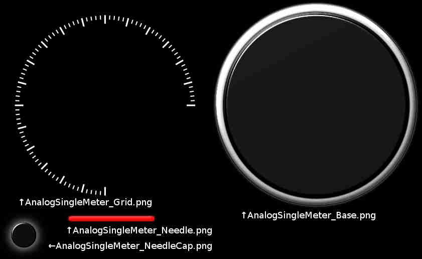
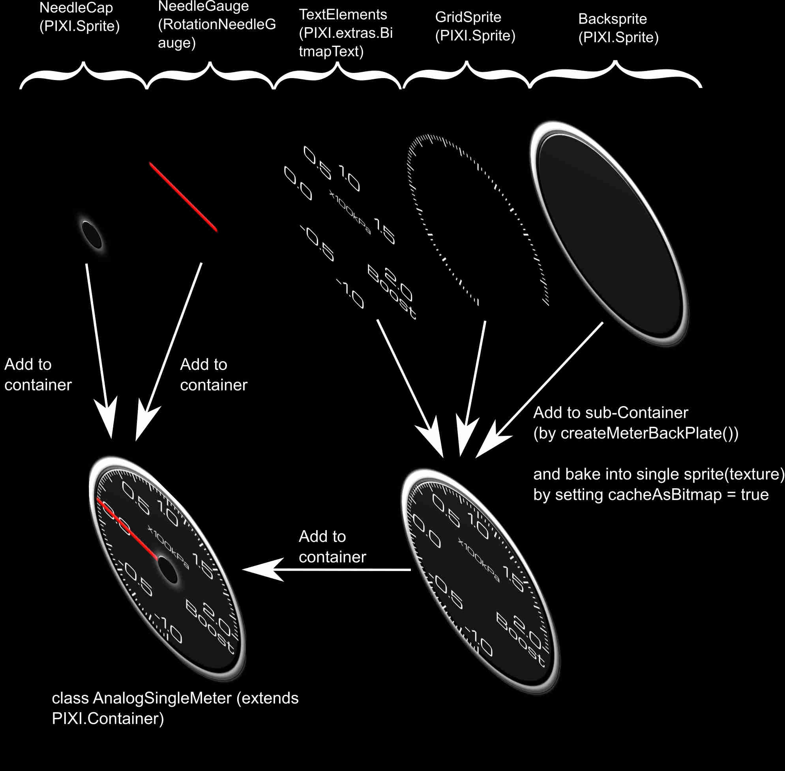

# Making custom meter parts

## Tools to make meter parts

* Drawing software to design([Inkscape](https://inkscape.org/))

* Bitmap edit software([GIMP](https://www.gimp.org/))

* Bitmap font creation tool ([BMFont](http://www.angelcode.com/products/bmfont/))

* Sprite sheet creation tool ([Leshy SpriteSheet Tool](https://www.leshylabs.com/apps/sstool/) or [TexturePacker](https://www.codeandweb.com/texturepacker))

* And before reading this document, it may be better to see some of Pixi.js [examples](http://pixijs.github.io/examples/) or [tutorials](http://www.pixijs.com/tutorials).

## Meter parts example

In this document, following "AnalogSingleMeter" class will be explained as a example.

.

* [The final code of AnalgSingleMeter](../src/parts/AnalogSingleMeter/AnalogSingleMeter.ts).

* [Design SVG file](../src/design/svgs/AnalogSingleMeter/AnalogSingleMeter.svg).

	* This svg (and this design) uses [Microma font](https://fonts.google.com/specimen/Michroma). Please install this font before opening the svg file.

## Design meter parts and export to PNG file.

First of all, design meter panel by drawing tool (such as Inkscape). After making design, export to PNG files.
This example separate meter design into 4 png files. These 4 png files (sprite, textures) will be combined while coding meter parts class.

.

## Making sprite sheet
On Pixi.js, making sprite sheet is recommened to handle textures, because of its performance optimization.
[Leshy SpriteSheet Tool](https://www.leshylabs.com/apps/sstool/) or [TexturePacker](https://www.codeandweb.com/texturepacker) can make sprite sheet for Pixi.js.
(Please set the sprite sheet map file format to 'JSON-Hash').

Sprite sheet tool will finally make one picture file (where all of sprite PNG files are merged) and one json file.
[Exported sprite sheet](../src/parts/AnalogSingleMeter/AnalogSingleMeter_0.png).
[Exported json file](../src/parts/AnalogSingleMeter/AnalogSingleMeter.json).

## Making bitmap font file
Pixi.js can handle various type of font, including TrueType and other types of Webfont.
Among them, bitmap font (PIXI.extras.BitmapText) is recommended because of its performance. (Vector type font needs rendereing every time the text is updated. This can make the performance overhead.)

[BMFont](http://www.angelcode.com/products/bmfont/) can make bitmap font file from TrueType fonts.

On exporting bitmap font, set font descriptor to "xml" and file format to "png" at "Options"->"Export options"->"File format".

## Coding meter parts class.
After preparing sprite(textures) and fonts, make a code of parts class.

This library currently have three types of primitive gauge parts. To know how to use these classes, please refer [MeterPrimitive.md](./MeterPrimitive.md). These gauge primitive parts classes can be treated like "Container" of PIXI.js, since they extends the PIXI.Container class.
* CircularProgressBar
* RectangularProgressBar
* RotationNeedleGauge
  

In this example, first make the master container class of "AnalogSingleMeter" (extends PIXI.Container), and add some child elements (Sprites and sub-containers).

[Final code of AnalgSingleMeter.ts](../src/parts/AnalogSingleMeter/AnalogSingleMeter.ts)

### Import dependent libraries and resources (textures and bitmap fonts).
```js
// Import dependent libraries (pixi.js and RotationNeedleGauge)
import {RotationNeedleGauge} from '../../lib/Graphics/PIXIGauge';
import {RotationNeedleGaugeOptions} from '../../lib/Graphics/PIXIGauge';

import * as PIXI from 'pixi.js';

// Set dependent texture files and bitmap font files (will be bundled by webpack file loader)
require("./AnalogSingleMeter.json");
require("./AnalogSingleMeter_0.png");
require("./Michroma_24px_Glow.fnt");
require("./Michroma_24px_Glow_0.png");
require("./Michroma_48px_Glow.fnt");
require("./Michroma_48px_Glow_0.png");
```
The first part of [AnalgSingleMeter.ts](../src/parts/AnalogSingleMeter/AnalogSingleMeter.ts) imports dependent library classes (pixi.js library, RotationNeedleGauge class and its option class) and resource files (textures(sprite sheet) and bitmap font files). These resource files will be bundled to build destination directory (WebSocketGaugeClientNeo/public_html) by webpack and webpack file loader.

### Creating option class
The second part of [AnalgSingleMeter.ts](../src/parts/AnalogSingleMeter/AnalogSingleMeter.ts) defines `AnalogSingleMeterOptions` class. This class stores setting of `AnalogSingleMeter`, such as Max/Min value, gauge title text, unit label text and scale label texts. (In this example, meter settings are defined in separate class.)
Of course, "Option" class is not absolutely necessary, and you can define meter panel setting in the meter class itself.

```js
/**
 * Setting option class for AnalogSingleMeter
 */
export class AnalogSingleMeterOption
{
    /**
     * Gauge Max.
     */
    public Max : number;
    /**
     * Gauge Min.
     */
    public Min : number;
    /**
     * Gauge Title
     */
    public Title : string;
    /**
     * Gauge unit
     */
    public Unit : string;
    /**
     * Gauge scale numbers (7 ticks).
     */
    public ScaleLabel : string[];
    
    /**
     * Construct AnalogSingleMeterOption with default settings.
     */
    constructor()
    {
        this.Max = 2.0;
        this.Min = -1.0;
        this.Title = "Boost";
        this.Unit = "x100kPa";
        this.ScaleLabel = ["-1.0","-0.5","0.0", "0.5", "1.0", "1.5", "2.0"];
    }
}
```

### Set class specific(static) property.
After that, `AnalogSingleMeter` class is defined. First, class member variables and properties are defined.

```js
/**
 * Analog single meter gauge example class
 */
export class AnalogSingleMeter extends PIXI.Container
{
    /**
     * The variable option class to define the design (max, min, title and scale labels).
     * @see AnalogSingleMeterOption
     */
    private Option : AnalogSingleMeterOption;
    
    /**
     * Texture path required by this parts. (This static property will be refered to pre-load texture).
     */
    static get RequestedTexturePath() : string[]
    {
        // Note : Bitmap font(*.fnt file) sholud be treated as "Texture" (not Webfont).
        return ["img/AnalogSingleMeter.json", "img/Michroma_24px_Glow.fnt",  "img/Michroma_48px_Glow.fnt"];
    }
    
    /**
     * Font family name required by this parts. (This static property will be refered to pre-load webfont).
     */
    static get RequestedFontFamily() : string[]
    {
        // No webfont(truetype) is needed on this parts. Return null array.
        return [];
    }
    
    /**
     * CSS URL(filepath) to define webfont, required by this parts. (This static property will be refered to pre-load webfont).
     */
    static get RequestedFontCSSURL() : string[]
    {
        // No webfont(truetype) is needed on this parts. Return null array.
        return [];
    }
    
    /**
     * Needle gauge object.
     */
    private NeedleGauge: RotationNeedleGauge;
    
    /**
     * Get gauge value.
     * @return Gauge value.
     */
    public get Value() { return this.NeedleGauge.Value }
    
    /**
     * Set gauge value (and update needle gauge).
     * @param val The value to set.
     */
    public set Value(val: number) {
        this.NeedleGauge.Value = val;
        this.NeedleGauge.update();
    }
    
    ...

}
```

On `AnalogSingleMeter`, 3 static readonly properties of `RequestedTexturePath`, `RequestedFontFamily` and `RequestedFontCSSURL` are defined.
These properties defines the name of texture, WebFont family name and the url of webfont css file.
These properties will be reffered by the file pre-loading setting of meter application class.
To know the detail, please see the "Define application class"->"Setup picture and font preloading" section in [CustomMeterApp.md](./CustomMeterApp.md).

Currently, these properties are NOT linked with `require()` statement at the first part of the code (see [previous section](#)). Texture and font names need to be defined on both `reqiure()` statememt and these static properties.

And please note that `RequestedFontFamily` and `RequestedFontCSSURL` properties only treat Webfont (such as TrueType font).
"Bitmap font" are treated as "Texture" here. That is why `*.fnt` (bitmap font definition file) files are defined in `RequestedTexturePath` property, not in the `RequestedFontFamily` property.
