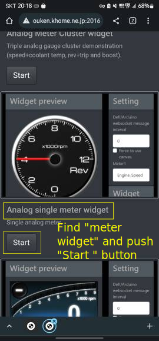
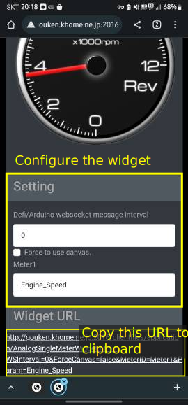
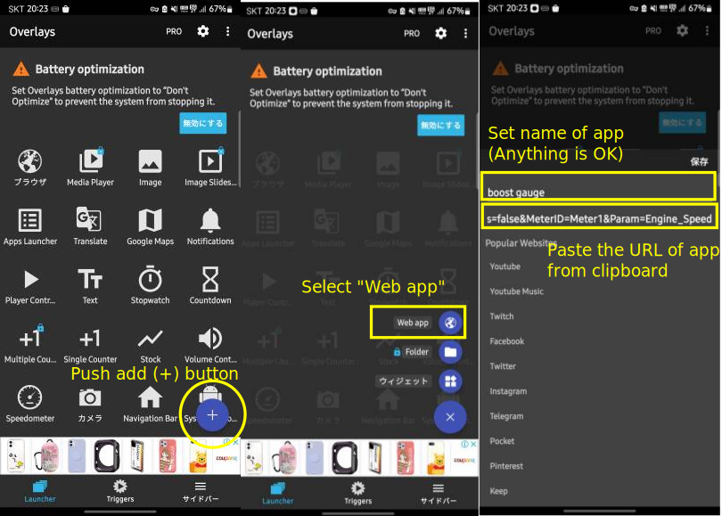
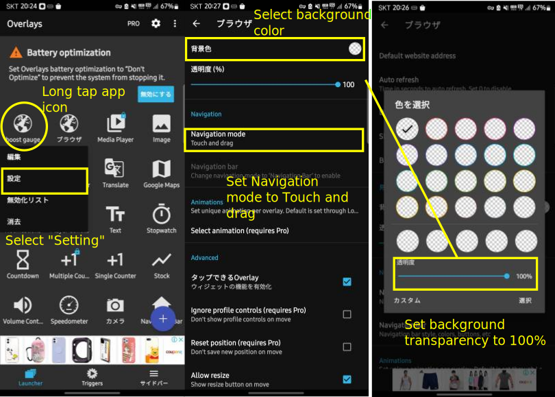

# Use gauge as floating widget (on Android)

## 1. Install "Overlays - Floating Launcher" app
First, install [Overlays - Floating Launcher](https://play.google.com/store/apps/details?id=com.applay.overlay) app from Google play.

## 2. Get URL of gauge application widget
Access gauge application html by browser.

On using gauge application sample package, you can access from Gauge Panel Widget Sample of `index.html`. And you can find the link of gauge application on "Gauge Panel Widget Sample" section.

.

After opening widget url by pushing "Start" button, you can modify the configuration of the widget. After setting configuration, copy the URL at "Widget URL" section to the clipboard.

.

## 3. Create webapp widget on "Overlays - Floating Launcher" app
1. Launch "Overlays"
2. Push "+" (add widget) button.
3. Select "Web app"
4. Set name of app (anything OK), and paste URL (copied in section 2) from clipboard, and push "save".

5. Long tap application icon (crated in step 4) to show context menu.
6. Open "Setting"
7. Set background color -> Transparency -> 100% (for transparent background)
8. Set "Navigation mode" to "Touch and drag", and tap back button to confirm the setting.

9. Setting is finished. You can show the widget by tapping application icon in Overlays menu.

