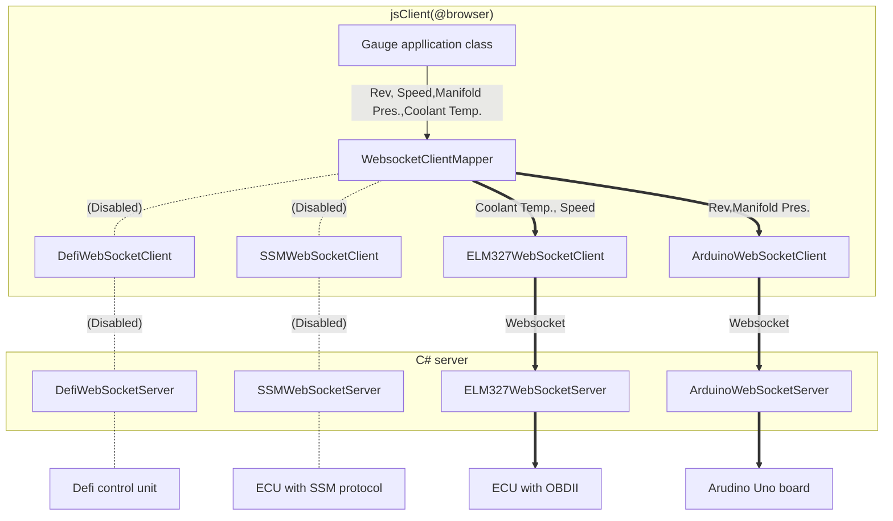
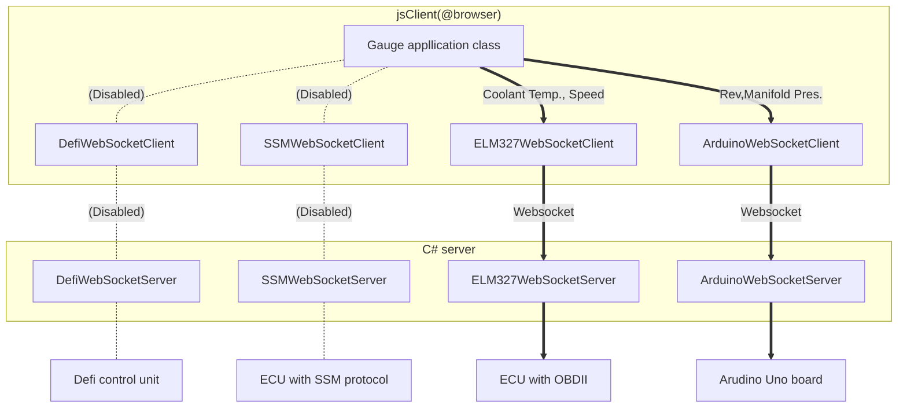

# Communication to WebsocketGaugeServer

## Calling websocket communication client from gauge application class

## Use websocket client
### Case 1 : Use websocket client through WebsocketClientMapper (recommend)
From Version 3.0, new features of `WebsocketClientMapper` is available. 
`WebsocketClientMapper` receives communication request from gauge application class, and distrubute to each websocket client classes following pre-defined mapping settings.

Using `WebsocketClientMapper` has follwing benefits,
* Gauge application class 

