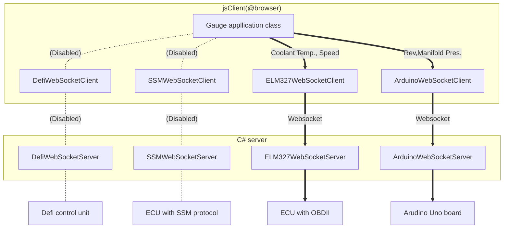
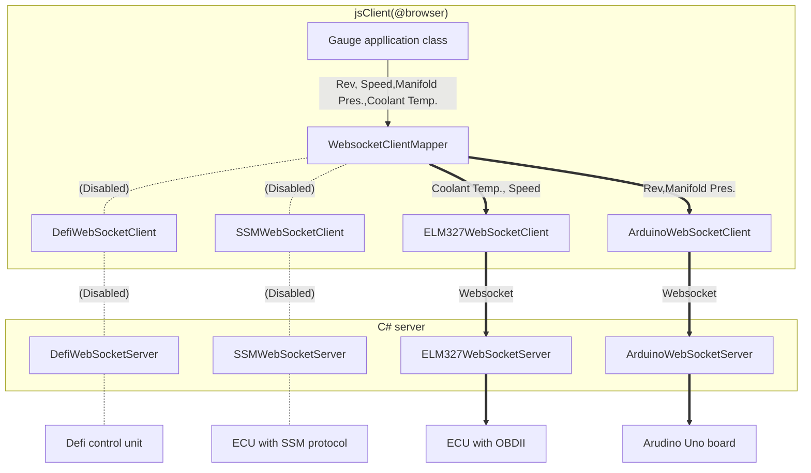

# Communication to WebsocketGaugeServer

## Calling websocket communication client from gauge application class

## Communication mode
### 1. Direct mode

```mermaid
    graph TD
        subgraph "jsClient(@browser)"
        A[Gauge appllication class] -.- |"(Disabled)"| B[DefiWebSocketClient]
        A -.- |"(Disabled)"| C[SSMWebSocketClient]
        A ==> |Coolant Temp., Speed|D[ELM327WebSocketClient]
        A ==> |Rev,Manifold Pres.| E[ArduinoWebSocketClient]
        end
        subgraph C# server
        B -.- |"(Disabled)"|B2[DefiWebSocketServer]
        C -.- |"(Disabled)"|C2[SSMWebSocketServer]
        D ==> |Websocket|D2[ELM327WebSocketServer]
        E ==> |Websocket|E2[ArduinoWebSocketServer]
        end
        B2 -.- B3[Defi control unit]
        C2 -.- C3[ECU with SSM protocol]
        D2 ==> D3[ECU with OBDII]
        E2 ==> E3[Arudino Uno board]
```

```mermaid
    graph TD
        subgraph "jsClient(@browser)"
        G[Gauge appllication class] --> |Rev, Speed,Manifold Pres.,Coolant Temp.|A
        A[WebsocketClientMapper] -.- |"(Disabled)"| B[DefiWebSocketClient]
        A -.- |"(Disabled)"| C[SSMWebSocketClient]
        A ==> |Coolant Temp., Speed| D[ELM327WebSocketClient]
        A ==> |Rev,Manifold Pres.| E[ArduinoWebSocketClient]
        end
        subgraph C# server
        B -.- |"(Disabled)"|B2[DefiWebSocketServer]
        C -.- |"(Disabled)"|C2[SSMWebSocketServer]
        D ==> |Websocket|D2[ELM327WebSocketServer]
        E ==> |Websocket|E2[ArduinoWebSocketServer]
        end
        B2 -.- B3[Defi control unit]
        C2 -.- C3[ECU with SSM protocol]
        D2 ==> D3[ECU with OBDII]
        E2 ==> E3[Arudino Uno board]
```
